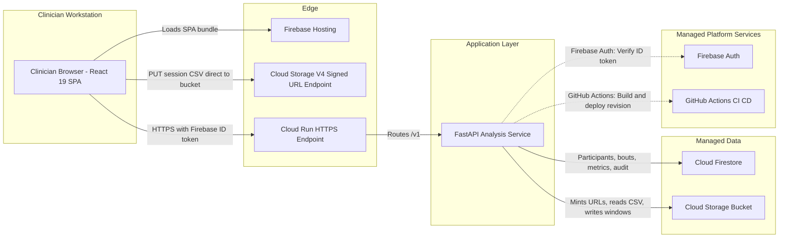
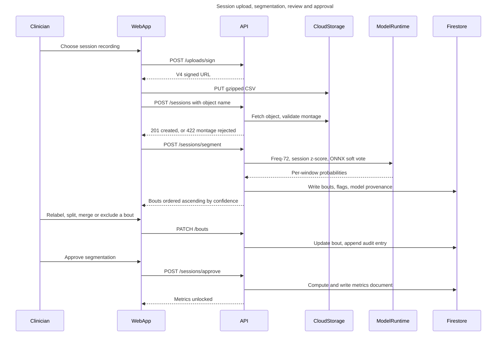
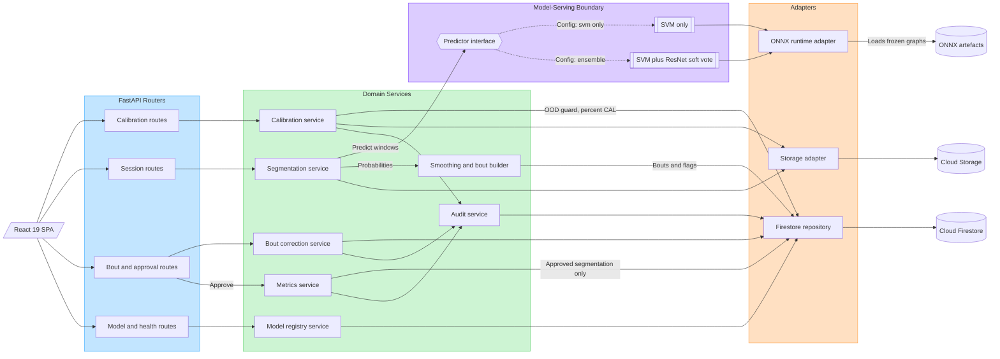

# UML Record — MyoLens

**FigJam board** `MyoLens — Deployment Architecture` (four diagrams on one board)
**File key** `AmUi76IJGKwAABqmqm3Hyy` · https://www.figma.com/board/AmUi76IJGKwAABqmqm3Hyy
**Date** 2026-08-13 · **Status** four diagrams built and visually verified

Companion to `design/DESIGN_RECORD.md`. That file records the ten screens; this one records the structural diagrams that sit behind them.

---

## 1. What is on the board

| # | Diagram | Type | Node | Covers |
|---|---|---|---|---|
| 01 | MyoLens — Deployment Architecture | Architecture flowchart | `1:2` | §8 of the plan of record |
| 02 | MyoLens — Upload, Segment, Review, Approve | Sequence | `2:52` | §10 API surface, scope items D, E, F |
| 03 | MyoLens — Firestore Document Model | ER diagram | loose tables, `3:152`–`3:695` | §9 data model |
| 04 | MyoLens — Internal Component Layering | Flowchart | sections `5:788`, `5:810`, `5:824`, `5:834` | §8 "Style" — the layered decomposition |

All four were generated from Mermaid source and are editable FigJam objects, not images — the Mermaid source for each is reproduced in §5 so the diagrams are regenerable rather than only redrawable.

Diagram 01 shows what is deployed; diagram 04 shows what is inside the one thing that is deployed. Keeping them separate is deliberate: putting the internal layers on the deployment diagram would imply the layers scale independently, and putting the managed services on the component diagram would bury the seam the component diagram exists to show.

---

## 2. Diagram 01 — deployment architecture

Six lanes, left to right: clinician workstation, edge, application layer, managed data, managed platform services.

**Decisions the diagram makes visible.**

- **The browser writes to Cloud Storage directly.** The upload path (`PUT session CSV direct to bucket`) does not pass through Cloud Run. This is not a shortcut; it is forced by the constraint in §8 — nine channels at 2 kHz is roughly 9.7 MB per minute of CSV and **Cloud Run caps HTTP/1 request bodies at 32 MB**, so a ten-minute session physically cannot be POSTed. The V4 signed-URL endpoint is drawn as its own edge node for exactly this reason: a reader who does not see it will assume the API proxies uploads and will mis-size the service.
- **One deployable service.** The FastAPI container is a single node. The layered structure inside it — routers → domain services → adapters — is an internal decomposition and does not belong on a deployment diagram; drawing it there would imply the layers scale independently, which they do not.
- **Firebase Auth and GitHub Actions are drawn as external, dotted.** They are managed platform services, not components of the system. The dotted edges keep the request path visually distinct from the trust path and the deployment path.
- **Firebase Hosting has no downstream edge.** It serves the SPA bundle and nothing else. The absence of an outgoing edge is information: there is no server-rendering step and no BFF layer.

**Known simplification.** The browser also talks to Firebase Auth directly at sign-in. The diagram shows only the API's token-verification edge, because the architecture-layout grammar routes external services through the service lane. Named here so the omission is a stated simplification rather than an error.

## 3. Diagram 02 — upload, segment, review, approve

Nineteen messages across six participants: Clinician, WebApp, API, CloudStorage, ModelRuntime, Firestore. One flow, happy path, with the montage rejection carried on the same response arrow (`201 created, or 422 montage rejected`) rather than drawn as a second branch.

**What the diagram is for.** It is the only artefact that shows the approval gate as a *temporal* fact rather than a design assertion. The metrics document is written to Firestore in the second-to-last message — after `POST /sessions/approve`, and nowhere earlier. FR-08 and scope item E7 say metrics are locked until a human approves; this diagram is the proof that the locking is structural rather than a UI state.

**Three details worth defending in the viva.**

- `ModelRuntime` is drawn as a participant even though it is in-process. It is the model-serving boundary from §8 — the seam that makes the SVM-only fallback a configuration change. A sequence diagram is where an interface earns a lifeline even when it does not earn a deployment box.
- The response to segmentation is labelled `Bouts ordered ascending by confidence`, not `Bouts`. The ordering is the mechanism by which 0.858 macro-F1 becomes a usable workflow, and it is an API contract, not a front-end sort.
- Every correction writes twice: `Update bout, append audit entry`. One message, two writes, which is what E8 requires.

**Renderer limitation, deliberately worked around.** The FigJam sequence renderer silently drops `Note`, `alt/else`, `loop` and activation bars. Rather than write them and ship a diagram that quietly lacks them, the flow was kept linear and the branch condition folded into a message label. If the alternative paths need drawing later they belong in a second diagram, not in dropped syntax.

## 4. Diagram 03 — Firestore document model

Eight entities: `USER`, `PARTICIPANT`, `CALIBRATION`, `SESSION`, `BOUT`, `METRICS`, `MODEL`, `AUDIT` — the six top-level collections and three subcollections of §9, with the subcollection nesting expressed as identifying (solid) relationships and the version references as non-identifying (dotted) ones.

**An ER diagram of a document store is a deliberate choice.** Firestore has no foreign keys and no referential integrity; the `FK` badges denote references the *application* maintains, not constraints the database enforces. Stating that is better than either drawing a shapeless document tree or implying guarantees the store does not give.

**Field-level facts the diagram carries.**

- `PARTICIPANT.code` is marked `UK` and annotated *"Pseudonymous. No name field exists"* — B1's acceptance criterion is the absence of a field, and absence is otherwise invisible in a schema diagram.
- `CALIBRATION.version` is annotated *"Supersedes, never overwrites"* (C5), and `oodFlag` *"Above threshold refuses segmentation"* (C4).
- `SESSION.approvedAt` is annotated *"Null until the approval gate passes"*. The nullability **is** the gate.
- `BOUT.excluded` is *"Retained in record, dropped from metrics"* (E6), and `originalLabel` preserves the model's proposal so `correction_rate` is computable.
- `MODEL` carries all three accuracy figures with their regimes — 0.858 transductive, 0.817 causal, 0.876 held-out at n = 3 — because FR-09 forbids a number without its protocol, and a registry that stores one number invites exactly that.
- `AUDIT.at` is annotated *"Client-immutable only. See TD-08"*. The debt is on the diagram, not just in the register.

**Layout fix applied.** The ELK layout initially overlapped `METRICS` on `BOUT` and `CALIBRATION` on `MODEL` by 24 px each — enough to clip the last attribute row of both upper tables. Both lower tables were moved down 124 px via the Plugin API. Same lesson as the screen build: generate, then look at it.

## 5. Diagram 04 — internal component layering

Five tiers left to right: the SPA, four FastAPI routers, seven domain services, the model-serving boundary, three adapters, and the managed data behind them. Subgraphs are tinted so the tier boundaries read at a glance — blue routers, green domain, violet serving boundary, amber adapters.

**This is the diagram §8's "Style" paragraph describes and the other three cannot show.**

- **The predictor is an interface, drawn as a hexagon, with two implementations behind dashed edges labelled `Config: svm only` and `Config: ensemble`.** That is the whole claim: the SVM-only fallback on the de-scope ladder is a configuration change, not a rewrite, and the next model attaches at the same seam. Drawn this way, the claim is checkable rather than asserted.
- **Nothing crosses a tier.** No router touches an adapter, no domain service touches Cloud Firestore. Every write to Firestore goes through the repository adapter. If the implementation ever violates that, the violation will be visible as an edge that skips a column.
- **`Smoothing and bout builder` is its own component**, downstream of the segmentation service rather than inside it. D6 is a named contribution whose effect on bout coherence is measured against the unsmoothed baseline in the Testing Report — it needs to be separable to be measurable.
- **`Audit service` takes edges from calibration, bout correction and metrics.** Auditing is not a cross-cutting decorator here; it is a component that three callers use, which is why E8's "one audit entry per operation" is testable.
- **`Metrics service` is reached only from the approval route**, and its edge to the repository is labelled *"Approved segmentation only"*. The gate appears in the component structure, not just in the sequence.

Six inbound edges converge on `Firestore repository` — right at the threshold where ELK usually needs a duplicated node. It routed cleanly, so the single shared node was kept: one repository is the truth, and drawing it six times would have implied otherwise.

---

## 6. Regenerable source

The Mermaid sources are held in this record so the board can be rebuilt if it is lost or needs amending.

### 01 Deployment architecture



Generated with the architecture layout code `FIGMA_DIAGRAM_2026`. Note the grammar constraint: `client` nodes may only connect to `gateway` or `service`, which is why the signed-URL upload target is modelled as an edge node.

### 02 Sequence



### 03 Firestore document model

The ER source is the §9 data model transcribed entity by entity, with `PK` / `FK` / `UK` badges and the annotations listed in §4 above. Relationships:

```
USER ||--o{ PARTICIPANT : creates
USER ||--o{ AUDIT : records
PARTICIPANT ||--o{ CALIBRATION : has
PARTICIPANT ||--o{ SESSION : has
CALIBRATION ||..o{ SESSION : normalises
SESSION ||--|{ BOUT : contains
SESSION ||--o| METRICS : yields
MODEL ||..o{ SESSION : segments
```

`SESSION ||--o| METRICS` is optional-to-one on purpose: an unapproved session has no metrics document, and the cardinality is the gate again.

### 04 Internal component layering



No `useArchitectureLayoutCode` — this is a generic ELK flowchart, not the architecture grammar. That is why it can show tiers the architecture layout would have rejected.

---

## 7. Gotchas paid for here

- **The architecture layout validates its own grammar and rejects the diagram outright.** A `client → datastore` edge returned an error rather than rendering badly. Route through `gateway` or `service`, or model the endpoint explicitly.
- **The sequence renderer silently drops** `Note`, `activate`, `loop`, `alt/else`, `opt`, `par`, `rect` and `autonumber`. Writing them costs nothing and delivers nothing — the diagram simply lacks the feature.
- **ER attribute comments should avoid pipe characters.** `"clinician or admin"` rather than `"clinician | admin"`.
- **ELK overlaps tall ER tables.** Two collisions in eight entities, both 24 px, both clipping a row. Screenshot the board and check bottoms against tops.
- Each `generate_diagram` call without a `fileKey` creates a **new** FigJam file. Pass the file key of the first board to keep the set together.

- **Subgraph tints matter in FigJam.** The canvas is near-white and an unstyled subgraph shows only a hairline. Diagram 04's four tiers are only legible as tiers because each subgraph carries a `style … fill` — one line of Mermaid per tier.

---

## 8. Coverage note

Five diagrams: use case (who does what), deployment (what runs where), interaction (what happens in what order), data (what is stored), and component (how the one service is decomposed). Between them they cover the structural views the architecture section needs.

**Deliberately not drawn**, and the reason, so the absence reads as a decision:

- **A state diagram of the session lifecycle** (`uploaded → validated → segmented → under review → approved`). Defensible to add, and the approval gate would show a third time. Cut because three artefacts already carry the gate and a fourth is repetition rather than evidence.
- **A class diagram.** A Python service organised around Pydantic models and thin service functions has no class hierarchy worth drawing: there is no inheritance to show, and the "classes" are records whose fields the ER diagram already lists. A class diagram here would be the data model redrawn with worse notation.

An earlier version of this note also gave the FigJam generator's lack of support as a reason for omitting two diagram types. That was a tooling constraint dressed as an engineering judgement, which is a bad habit in a design record — the diagram is either worth drawing or it is not, and what happens to be convenient in one editor has no bearing on the answer. Both were reconsidered on the merits: the class diagram stays out for the reason above, and the use-case diagram was drawn.

## 9. Rendered diagrams, and how to regenerate them

The FigJam board is where these were authored, but a board is not a deliverable: it needs an account, a link and a permission grant, and it cannot be diffed. The rendered SVGs are committed at `docs/diagrams/`, and their source is committed beside them at `design/mermaid/`, so the picture in the report and the source in the repository cannot drift apart.

| Diagram | Source | Rendered |
|---|---|---|
| 05 Use case | `design/mermaid/05-use-case.mmd` | `docs/diagrams/05-use-case.svg` |
| 01 Deployment architecture | `design/mermaid/01-deployment-architecture.mmd` | `docs/diagrams/01-deployment-architecture.svg` |
| 02 Sequence — upload → segment → review → approve | `design/mermaid/02-sequence-upload-segment-review-approve.mmd` | `docs/diagrams/02-sequence-upload-segment-review-approve.svg` |
| 03 Firestore document model (ER) | `design/mermaid/03-firestore-document-model.mmd` | `docs/diagrams/03-firestore-document-model.svg` |
| 04 Internal component layering | `design/mermaid/04-component-layering.mmd` | `docs/diagrams/04-component-layering.svg` |

```bash
npm install -g @mermaid-js/mermaid-cli
for f in design/mermaid/*.mmd; do
  mmdc -i "$f" -o "docs/diagrams/$(basename "${f%.mmd}").svg" -b white
done
```

**Two honest notes on the rendering.** Mermaid has no use-case diagram type, so diagram 05 is a flowchart carrying use-case *semantics*: actors outside the boundary, use cases as ovals inside it, and `«include»` on the dependencies. The association lines from an actor are drawn to the boundary rather than visibly terminating on each oval, which is a layout limitation and not a claim about the associations. And the ER diagram's attributes were transcribed from the `to_document()` methods in `backend/app/domain/`, not from the plan of record — the code is what actually shapes the stored documents, so it is the authority when the two could disagree.
